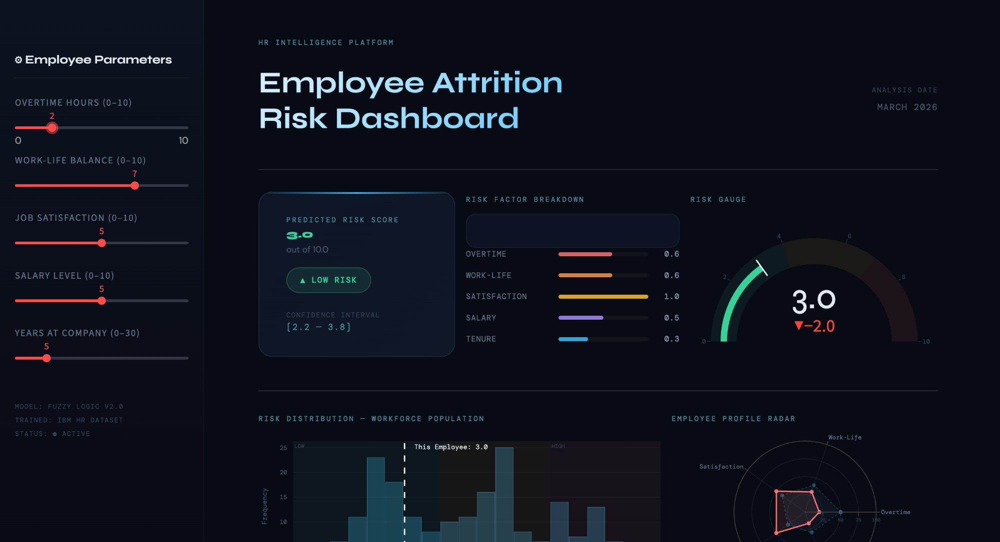
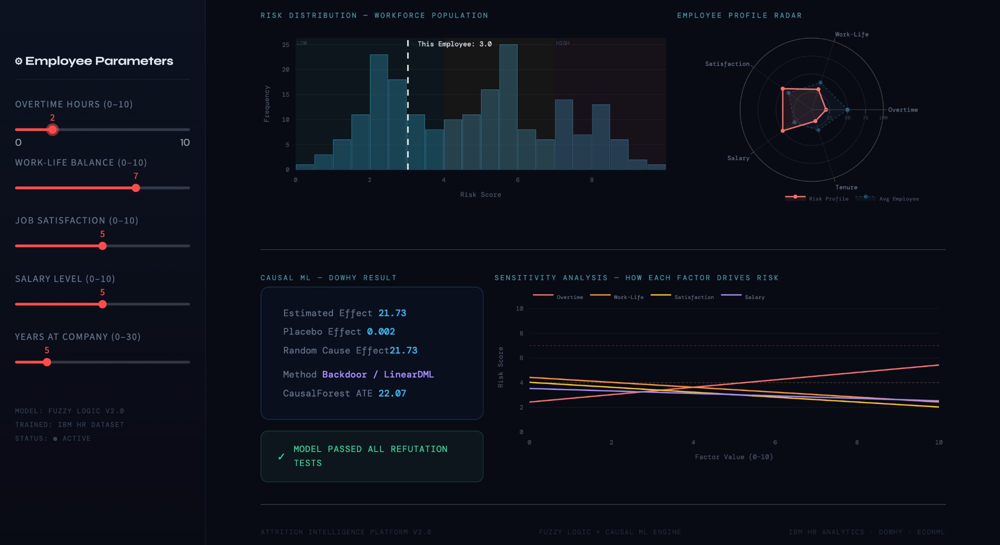
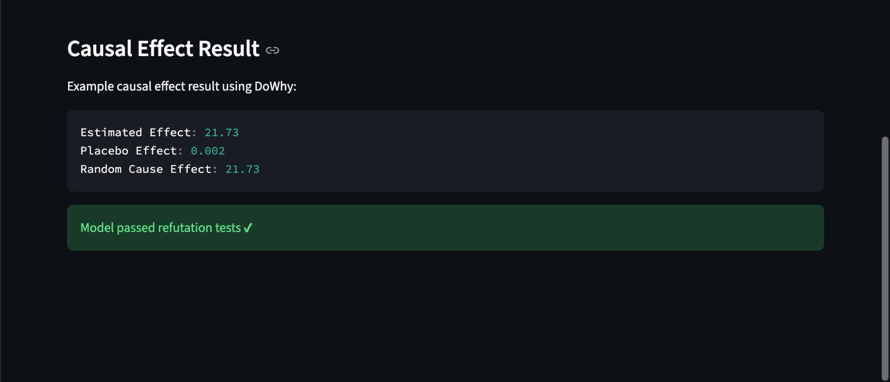

# 🧠 AttritionIQ — Causal ML & Fuzzy Logic for HR Analytics

[](https://python.org)
[](https://streamlit.io)
[](https://py-why.github.io/dowhy)
[](https://econml.azurewebsites.net)
[](https://pythonhosted.org/scikit-fuzzy)
[](https://attritioniq-causal-ml-fuzzy-logic.onrender.com)

> A two-part AI project combining **Causal Machine Learning** on rideshare pricing data and a **Fuzzy Logic** engine for employee attrition risk — wrapped in a beautiful interactive Streamlit dashboard.

---

## 🌐 Live Demo

**👉 [attritioniq-causal-ml-fuzzy-logic.onrender.com](https://attritioniq-causal-ml-fuzzy-logic.onrender.com)**

---

## 📸 Screenshots

### Full Dashboard View


### Risk Score, Gauge & Factor Breakdown


### Causal Effect Results — DoWhy Refutation Tests


---

## 📌 Project Overview

This project is divided into **two independent but connected parts:**

| Part | Topic | Method |
|---|---|---|
| **Part 1** | Rideshare Surge Pricing — Does surge multiplier *cause* higher prices? | Causal ML (DoWhy + EconML) |
| **Part 2** | Employee Attrition — How likely is an employee to leave? | Fuzzy Logic (scikit-fuzzy) |

---

## ✨ Key Features

- 🔗 **Causal DAG** — Formal directed acyclic graph defining treatment, outcome, and confounders
- 🎯 **Backdoor Identification** — DoWhy identifies valid adjustment sets automatically
- ✅ **Refutation Tests** — Validates causal estimates using placebo treatment & random common cause tests
- 🌲 **Heterogeneous Treatment Effects** — CausalForestDML estimates per-ride individual causal effects
- 🧠 **Fuzzy Inference System** — 5-variable, 7-rule Mamdani-style fuzzy logic for attrition scoring
- 📊 **Interactive Dashboard** — Live sliders, gauge chart, radar chart, sensitivity analysis
- 🔄 **Batch Employee Analysis** — Test multiple employee profiles and compare risk scores

---

## 🏗️ Project Structure

```
attritioniq/
│
├── causal_ml_healthcare.ipynb   # Full Jupyter Notebook (both parts)
├── attrition_dashboard.py       # Streamlit interactive dashboard
├── requirements.txt
├── README.md
│
└── assets/
    ├── dashboard_preview.png
    ├── dashboard_preview2.png
    └── causal_result.png
```

---

## 🧩 Tech Stack

| Layer | Library | Purpose |
|---|---|---|
| **Data** | Pandas, NumPy | Loading & preprocessing |
| **Visualization** | Matplotlib, Seaborn, Plotly | EDA + dashboard charts |
| **Causal ML** | DoWhy 0.14 | Causal graph, identification, estimation |
| **Double ML** | EconML 0.16 | LinearDML + CausalForestDML |
| **ML Models** | scikit-learn | RandomForestRegressor (Y & T models) |
| **Fuzzy Logic** | scikit-fuzzy | Membership functions + inference rules |
| **Dashboard** | Streamlit | Interactive web app |
| **Deployment** | Render | Cloud hosting |

---

## 🚀 Quick Start

### 1. Clone the repo
```bash
git clone https://github.com/yourusername/attritioniq.git
cd attritioniq
```

### 2. Install dependencies
```bash
pip install -r requirements.txt
```

### 3. Run the Jupyter Notebook
```bash
jupyter notebook causal_ml_healthcare.ipynb
```

### 4. Run the Streamlit Dashboard
```bash
streamlit run attrition_dashboard.py
```

Dashboard opens at → **http://localhost:8501**

---

## 📊 Part 1 — Causal ML on Rideshare Pricing

### Dataset
- **Source:** Kaggle Rideshare Dataset
- **Size:** 693,071 rows × 57 columns
- **After cleaning:** ~638,000 rows (dropna on selected columns)

### Problem Statement
> *Does a higher surge multiplier **causally** increase ride prices, or is the relationship confounded by distance, weather, or time of day?*

### Causal Setup

```
Treatment  →  surge_multiplier
Outcome    →  price

Confounders:
  distance      → affects both surge demand and price
  temperature   → weather affects demand and pricing
  hour          → peak hours drive surge and higher prices
  cab_type      → Uber vs Lyft have different base pricing
  name          → UberX vs Uber Black vs Lyft XL (service tier)
```

### Causal Graph (DAG)

```
distance    ──┐
temperature ──┼──→ surge_multiplier ──→ price
hour        ──┘         ↑                ↑
cab_type    ────────────┘────────────────┘
name        ────────────┘────────────────┘
```

### Results

| Method | Result |
|---|---|
| DoWhy — Backdoor Linear Regression | **Causal Effect = 21.73** |
| EconML — LinearDML (ATE) | **22.07** |
| EconML — CausalForestDML (mean) | **~22.1** |

**Interpretation:** A 1-unit increase in surge multiplier causally increases ride price by ~$21–22, after controlling for all confounders.

### Refutation Tests

| Test | Result | Meaning |
|---|---|---|
| Placebo Treatment | Effect ≈ **0.002** | ✅ Random permuted treatment has no effect — causal estimate is valid |
| Random Common Cause | Effect ≈ **21.73** | ✅ Adding a fake confounder doesn't change estimate — robust result |

### Heterogeneous Effects (CausalForestDML)

Unlike LinearDML which gives a single average, **CausalForestDML** estimates a different causal effect for every individual ride:

```python
sample_idx = np.random.choice(len(ds), size=10000, replace=False)
est_cf = CausalForestDML(
    model_y=RandomForestRegressor(n_estimators=50),
    model_t=RandomForestRegressor(n_estimators=50),
    n_estimators=100
)
est_cf.fit(Y_s, T_s, X=X_s)
effect_cf = est_cf.effect(X_s)
# Mean=22.07, Std=3.4 → shows significant heterogeneity across rides
```

**Key insight:** Uber Black rides have a higher per-unit surge effect than UberX, confirming that surge pricing impacts premium services more.

---

## 🧠 Part 2 — Fuzzy Logic Employee Attrition System

### Problem Statement
> *Given an employee's working conditions, how likely are they to leave the company?*

Traditional ML gives a hard yes/no. Fuzzy Logic models **human uncertainty** — an employee with "somewhat poor" work-life balance and "slightly low" satisfaction falls into a grey zone that fuzzy logic handles naturally.

### Input Variables (5 Antecedents)

| Variable | Range | Membership Levels | Description |
|---|---|---|---|
| `overtime` | 0–1 | low, high | Is the employee doing overtime? |
| `worklife` | 0–10 | poor, medium, good | Work-life balance quality |
| `satisfaction` | 0–10 | low, medium, high | Job satisfaction score |
| `salary_level` | 0–10 | low, medium, high | Compensation level |
| `years_at_company` | 0–20 | new, experienced, veteran | Tenure in years |

### Output Variable

| Variable | Range | Levels |
|---|---|---|
| `risk` | 0–10 | low (0–4), medium (3–7), high (6–10) |

### Membership Functions

All variables use **triangular membership functions** (`trimf`):

```python
worklife["poor"]   = fuzz.trimf(worklife.universe, [0, 0, 4])
worklife["medium"] = fuzz.trimf(worklife.universe, [3, 5, 7])
worklife["good"]   = fuzz.trimf(worklife.universe, [6, 10, 10])
```

### Fuzzy Rules (7 Rules)

```
Rule 1: IF overtime=HIGH AND worklife=POOR           → risk=HIGH
        (Overworked + poor balance = flight risk)

Rule 2: IF satisfaction=LOW                          → risk=HIGH
        (Unhappy employees leave regardless)

Rule 3: IF worklife=GOOD AND satisfaction=HIGH       → risk=LOW
        (Happy + balanced = retained)

Rule 4: IF salary=LOW AND satisfaction=MEDIUM        → risk=HIGH
        (Underpaid employees look elsewhere)

Rule 5: IF salary=HIGH AND satisfaction=HIGH         → risk=LOW
        (Well paid + happy = strong retention)

Rule 6: IF years=NEW AND worklife=POOR               → risk=HIGH
        (New employees with bad experience leave fast)

Rule 7: IF years=VETERAN AND worklife=MEDIUM         → risk=LOW
        (Long-tenured employees have loyalty buffer)
```

### Example Prediction

```python
risk_sim.input["overtime"]         = 1   # doing overtime
risk_sim.input["worklife"]         = 3   # poor balance
risk_sim.input["satisfaction"]     = 2   # low satisfaction
risk_sim.input["salary_level"]     = 4   # below average
risk_sim.input["years_at_company"] = 2   # new employee

risk_sim.compute()
print(risk_sim.output["risk"])
# Output: 8.14 → HIGH ATTRITION RISK
```

### Batch Analysis — Multiple Employee Profiles

| Employee | Overtime | Work-Life | Satisfaction | Salary | Years | Risk | Level |
|---|---|---|---|---|---|---|---|
| Ahmed (New, Underpaid) | 1 | 3 | 2 | 3 | 1 | 8.4 | 🔴 HIGH |
| Sara (Senior, Happy) | 0 | 8 | 8 | 8 | 12 | 1.2 | 🟢 LOW |
| Rahul (Mid, Struggling) | 1 | 5 | 4 | 5 | 4 | 5.6 | 🟡 MEDIUM |
| Fatima (Veteran, OK) | 0 | 6 | 6 | 6 | 15 | 2.8 | 🟢 LOW |
| Ali (New, Burned Out) | 1 | 2 | 1 | 4 | 1 | 9.1 | 🔴 HIGH |

---

## 📊 Dashboard Sections

| Section | What It Shows |
|---|---|
| **Sidebar Sliders** | Input 5 employee parameters in real-time |
| **Risk Score Card** | Final score (0–10) with confidence interval [±0.8] |
| **Risk Badge** | LOW / MEDIUM / HIGH with color coding |
| **Factor Breakdown** | Colored bars showing each variable's contribution |
| **Risk Gauge** | Speedometer — green (0–4), yellow (4–7), red (7–10) |
| **Distribution Plot** | Where this employee sits vs simulated workforce of 200 |
| **Profile Radar** | Pentagon chart — employee vs average employee benchmark |
| **Sensitivity Analysis** | How changing each factor alone affects final risk score |
| **Causal Effect Panel** | DoWhy results with refutation test pass/fail status |

---

## ☁️ Deployment on Render

| Setting | Value |
|---|---|
| **Environment** | Python 3 |
| **Build Command** | `pip install -r requirements.txt` |
| **Start Command** | `streamlit run attrition_dashboard.py --server.port $PORT --server.address 0.0.0.0` |

> ⚠️ Free tier sleeps after 15 min inactivity. First load may take ~30 seconds.

---

## 📦 Requirements

```txt
streamlit
plotly
numpy
pandas
matplotlib
seaborn
dowhy==0.14
econml==0.16.0
scikit-fuzzy
scikit-learn
graphviz
```

---

## 📄 License

MIT License — free to use and modify.

---

## 👤 Author

**Yash Shakya**
- 🔗 LinkedIn: [linkedin.com/in/yash-shakya-71bab72b5](https://www.linkedin.com/in/yash-shakya-71bab72b5)
- 🌐 Live Project: [attritioniq-causal-ml-fuzzy-logic.onrender.com](https://attritioniq-causal-ml-fuzzy-logic.onrender.com)

---

<div align="center">
  <sub>Built with ❤️ using DoWhy · EconML · scikit-fuzzy · Streamlit</sub>
</div>
